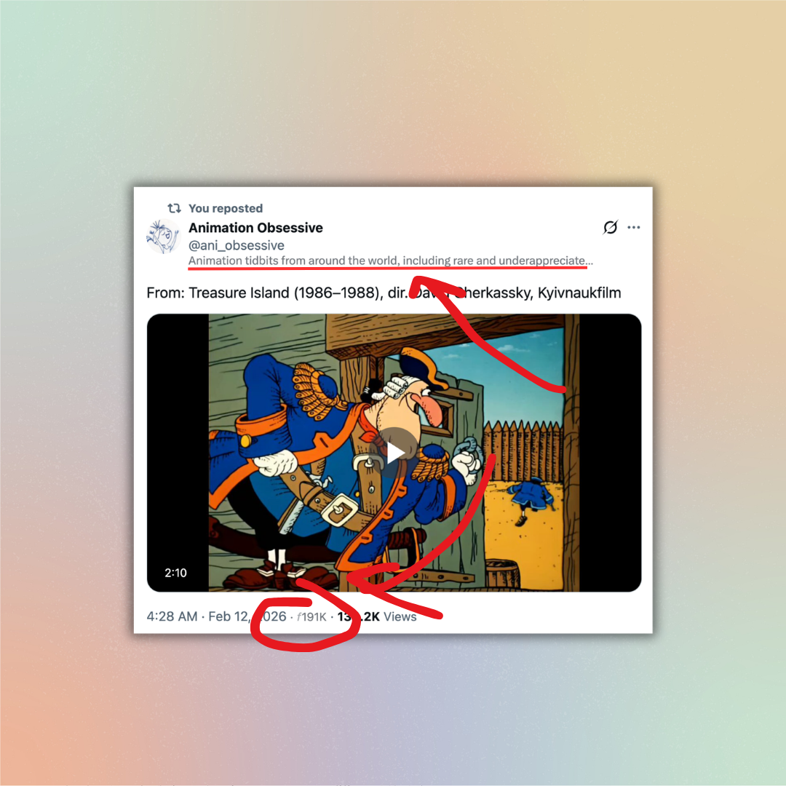
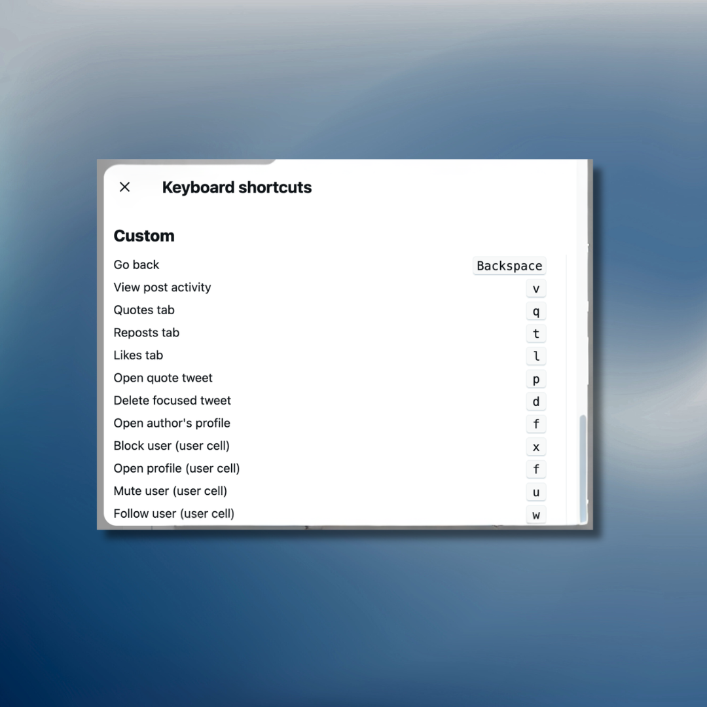

# Twitter/X Userscripts

A collection of userscripts that add keyboard shortcuts, inline information, and quality-of-life improvements to Twitter/X.

## Scripts

| Script | Description | Key | Install |
|--------|-------------|-----|---------|
| [Inline Follower Count](twitter-inline-follower-count.user.js) | Displays follower count and bio directly inline in tweets and user cells. Uses Twitter's GraphQL API. | -- | [Install](https://raw.githubusercontent.com/digitalby/twitter-userscripts/main/twitter-inline-follower-count.user.js) |
| [Backspace to Go Back](twitter-backspace-back.user.js) | Press Backspace to navigate back using Twitter's soft SPA navigation. | `Backspace` | [Install](https://raw.githubusercontent.com/digitalby/twitter-userscripts/main/twitter-backspace-back.user.js) |
| [Post Activity Hotkeys](twitter-post-activity-hotkeys.user.js) | View post activity and switch tabs for Quotes, Reposts, and Likes. | `v` `q` `t` `l` | [Install](https://raw.githubusercontent.com/digitalby/twitter-userscripts/main/twitter-post-activity-hotkeys.user.js) |
| [Delete Hotkey](twitter-delete-hotkey.user.js) | Delete a focused tweet via the three-dot menu. | `d` | [Install](https://raw.githubusercontent.com/digitalby/twitter-userscripts/main/twitter-delete-hotkey.user.js) |
| [Open Quote Tweet](twitter-quote-hotkey.user.js) | Open a focused tweet's embedded quote tweet. | `p` | [Install](https://raw.githubusercontent.com/digitalby/twitter-userscripts/main/twitter-quote-hotkey.user.js) |
| [Open Profile](twitter-profile-hotkey.user.js) | Open the author's profile from a focused tweet. | `f` | [Install](https://raw.githubusercontent.com/digitalby/twitter-userscripts/main/twitter-profile-hotkey.user.js) |
| [User Cell Hotkeys](twitter-usercell-hotkeys.user.js) | Keyboard shortcuts on user cells (follower lists, search results, etc.). | `x` `f` `u` `w` | [Install](https://raw.githubusercontent.com/digitalby/twitter-userscripts/main/twitter-usercell-hotkeys.user.js) |

### Shared Library

**[twitter-custom-keys.lib.js](twitter-custom-keys.lib.js)** -- Shared library that adds a "Custom" section to Twitter's built-in `?` keyboard shortcuts dialog, showing all registered custom shortcuts. This file is loaded automatically via `@require` by the hotkey scripts above and does not need to be installed separately.

## Installation

### Desktop Browsers

You need a userscript manager extension. Recommended options:

- **[Tampermonkey](https://www.tampermonkey.net/)** -- Chrome, Firefox, Edge, Opera (recommended)
- **[Violentmonkey](https://violentmonkey.github.io/)** -- Chrome, Firefox, Edge
- **[Greasemonkey](https://www.greasespot.net/)** -- Firefox only

**Steps:**

1. Install one of the extensions above.
2. Click the **Install** link for any script in the table above.
3. The userscript manager will show an install prompt. Click **Install**.

### iOS (Safari)

- **[Userscripts](https://apps.apple.com/us/app/userscripts/id1463298887)** -- free, open source, available on the App Store

**Steps:**

1. Install Userscripts from the App Store.
2. Go to Settings > Safari > Extensions and enable Userscripts.
3. Open Safari, tap the extension icon, and set a script directory.
4. Add scripts to that directory or install via the raw GitHub links above.

### Android

- **[Tampermonkey](https://www.tampermonkey.net/)** for Firefox Android

**Steps:**

1. Install [Firefox for Android](https://play.google.com/store/apps/details?id=org.mozilla.firefox).
2. Add the Tampermonkey extension from the Firefox add-ons menu.
3. Click the **Install** links above to install scripts.

## Notes

- All hotkey scripts ignore input when typing in text fields, textareas, or contenteditable elements.
- Modifier keys (Ctrl, Cmd, Alt) are ignored to avoid conflicts with browser shortcuts.
- Tweet-level hotkeys (`d`, `p`, `f`) operate on the tweet focused via Twitter's built-in `j`/`k` navigation.
- Scripts work on both `twitter.com` and `x.com`.

## License

MIT
